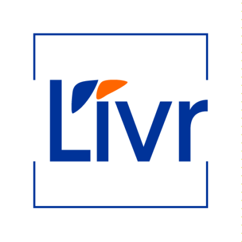

<!-- Replace with your organization’s logo -->

  

# Liver Cell Biology (LIVR)

Brussels Health Campus • Vrije Universiteit Brussel

---

## 🔬 Mission
Advance understanding of liver cell diversity, regeneration and fibrosis to drive novel biomarkers, in vitro disease models and therapeutic strategies for chronic liver disorders.

---

## 🎯 Research Objectives
- **Cellular Characterization**  
  Profile healthy vs. diseased liver cell types at single‑cell resolution.  
- **Fibrosis Mechanisms**  
  Dissect pathways of hepatic stellate cell activation, fibrogenesis and resolution.  
- **Biomarker Discovery**  
  Identify stellate‑cell‑specific markers for non‑invasive fibrosis staging.  
- **Disease Modeling**  
  Build iPSC‑derived liver cell co‑cultures and organoids to recreate MASLD and other chronic conditions.  
- **Regeneration & Progenitors**  
  Elucidate the role of liver progenitor cells in tissue repair.

---

## 🤝 Key Collaborations & Networks
- **ImAgE‑D** (Marie Skłodowska‑Curie ITN, Oct 2023 – Sep 2027)  
  High‑speed, super‑resolution imaging of endothelial and liver cells.  
- **DeLIVERy** (EIC Pathfinder, May 2022 – Apr 2026)  
  Personalized polypharmacy testing on patient‑derived mini‑livers.

---

## 📚 Publications & Resources
- **Latest Publications**  
  - *JHEP Reports*: “HSC single‑cell atlas reveals activation across etiologies” 
  - *Biofabrication*: “iPSC‑derived liver spheroids to model fibrosis” 
  - *Science*: “Hippo signaling instructs ectopic organ growth” 
- **Full Library**  
  Browse all [publications (2010–present)](https://livr.research.vub.be/Publications) and [archived volumes (2000–2009)](https://livr.research.vub.be/Publications).

---

## 👥 Team & Training
- **Current Members** | **Former Members**  
  Explore profiles and roles on our [Team page](https://livr.research.vub.be/Team).  
- **Doctoral & Post‑doc Training**  
  Interactive workshops, imaging courses, and 3R‑principle seminars for early‑career researchers.

---

## 📰 News & Events
- **Belgian Stem Cell Meeting** – Nov 28 2025 @ ULB Erasme Campus  
- **Upcoming Seminars** & “Film Nights” showcasing 3R approaches and mini‑liver therapies  
- Follow live updates in [News & Events](https://livr.research.vub.be/News).

---

## 📫 Contact
Laarbeeklaan 103, Building D – Room D022  
1090 Brussels, Belgium  
✉️ jmlazou@vub.be | ☎️ +32 2 477 4409  

---

> _“By unlocking liver cell biology, we pave the way for precision therapies in chronic liver disease.”_

